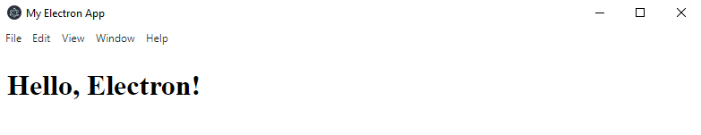
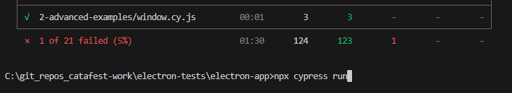

# electron-app teste with cypress 

[](https://www.cypress.io/)

[](https://dl.circleci.com/status-badge/redirect/gh/catafest-work/bun_cypress/tree/main)

smple application with electron  with simple test with cypress 

use :

```
electron-app>npm run start

> electron-app@1.0.0 start
> electron .
```

Result of electron appplication :



Use : 
``` \electron-app>npx cypress run ```
The result of cypress tests running in terminal : 



If you want to use cypress browsers , then use :

``` npx cypress open ```
